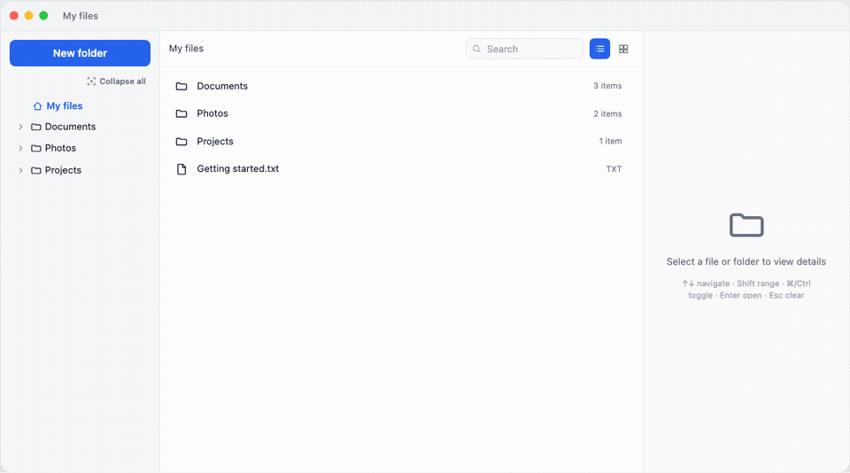

# @halazv2/react-file-manager

[](https://www.npmjs.com/package/@halazv2/react-file-manager)
[](./LICENSE)
[](https://halazv2.github.io/react-file-manager/)

Headless-ish React file browser with **Finder-style spring-loaded folders**, drag-and-drop, built-in icons, pins/recents, in-pane preview, and host-driven action menus. Bring your own data and API — keep viewers (Foxit, OnlyOffice) and domain actions in the host.

**Live demo:** https://halazv2.github.io/react-file-manager/



Hover a folder while dragging — it expands in the sidebar and opens in the browser after a short delay, just like macOS Finder.

## Install

```bash
npm install @halazv2/react-file-manager
```

Peer dependencies: `react` and `react-dom` ≥ 18. Optional peer: `pdfjs-dist` ≥ 4 (PDF first-page thumbnails).

### Tailwind (default styling)

The UI is built with Tailwind classes. Point Tailwind at the package, or import the prebuilt stylesheet.

**Tailwind v4**

```css
@import "tailwindcss";
@source "../node_modules/@halazv2/react-file-manager/dist";

@theme {
  --color-rfm-primary: #2563eb;
  --color-rfm-hover: color-mix(in srgb, #2563eb 12%, transparent);
}
```

**Prebuilt CSS** (no Tailwind setup required)

```ts
import "@halazv2/react-file-manager/styles.css";
```

Theme with CSS variables on `.rfm-root`, or override the Tailwind theme tokens:

```css
.rfm-root {
  --rfm-primary: #0f766e; /* reflow / brand */
  --rfm-hover: color-mix(in srgb, var(--rfm-primary) 12%, transparent);
  --rfm-surface: #ffffff;
  --rfm-muted: #6b7280;
}
```

## Quick start

```tsx
import { FileManager, moveNodes, type FileManagerNode } from "@halazv2/react-file-manager";
import { useState } from "react";

const initial: FileManagerNode[] = [
  {
    id: "docs",
    name: "Documents",
    kind: "folder",
    children: [{ id: "notes", name: "notes.txt", kind: "file", extension: "txt" }]
  }
];

export function App() {
  const [nodes, setNodes] = useState(initial);

  return (
    <div style={{ height: 560 }}>
      <FileManager
        nodes={nodes}
        storageKey="my-app-files"
        onMove={(ids, folderId) =>
          setNodes((current) => moveNodes(current, ids, folderId))
        }
        onOpenFile={(id) => console.log("open", id)}
        onGetPreviewUrl={(id) => `/api/files/${id}/preview`}
        onUpload={(files, folderId) => console.log(files, folderId)}
        onCreateFolder={(parentId) => console.log("new folder in", parentId)}
        onCreateFile={(folderId) => console.log("new file in", folderId)}
        onRename={(id, name) => console.log("rename", id, name)}
        onDownloadFile={(id) => console.log("download", id)}
        getItemActions={(node) => [
          { id: "open", label: "Open", onClick: () => console.log(node.id) }
        ]}
        getBulkActions={(ids) => [
          { id: "merge", label: "Merge", onClick: () => console.log(ids) }
        ]}
      />
    </div>
  );
}
```

The component fills its parent. Give the parent a height.

## What it includes

- Three-pane layout: sidebar, browser (list/cards), details
- Built-in extension-aware file/folder icons
- Pins and recent folders (`storageKey` → localStorage)
- Breadcrumbs, multi-select, keyboard navigation
- Drag-and-drop move with spring-loaded folders
- Virtualized list view for large folders
- In-pane preview: images always; PDF first page + text when `pdfjs-dist` is installed and `onGetPreviewUrl` is set
- Context / “more” menus via `getItemActions`
- Bulk action bar via `getBulkActions` (Open / Delete defaults when callbacks exist)
- Rename, download file/folder, create file hooks
- Theme tokens (`--rfm-primary`, `--rfm-hover`, surfaces)

Host apps own document viewers, merge/split, RBAC, and domain modals — wire them through callbacks and action getters.

## Adapter example (reflow-style)

```ts
import type { FileManagerNode } from "@halazv2/react-file-manager";

type LibraryNode = {
  id: number;
  name: string;
  type: "folder" | "file";
  children?: LibraryNode[];
  extension?: string;
  file?: string;
};

export function mapLibraryToNodes(nodes: LibraryNode[]): FileManagerNode[] {
  return nodes.map((node) => ({
    id: String(node.id),
    name: node.name,
    kind: node.type === "folder" ? "folder" : "file",
    extension: node.extension,
    children: node.children ? mapLibraryToNodes(node.children) : undefined,
    meta: { file: node.file, sourceId: node.id }
  }));
}
```

## Props

| Prop | Type | Notes |
| --- | --- | --- |
| `nodes` | `FileManagerNode[]` | Nested tree. Root is implied. |
| `folderId` / `defaultFolderId` | `string \| null` | Current folder. `null` is root. |
| `storageKey` | `string` | Pins / recents localStorage key. |
| `onMove` | `(ids, folderId) => void` | Fired on drop. Use `moveNodes` for local state. |
| `onOpenFile` | `(id) => void` | Double-click or Enter on a file. |
| `onGetPreviewUrl` | `(id) => string \| null \| Promise<…>` | Preview URL for details pane. |
| `onUpload` | `(files, folderId) => void` | OS file drop or empty-state upload. |
| `onCreateFolder` | `(parentId) => void` | New folder action. |
| `onCreateFile` | `(folderId) => void` | Optional “new document” entry. |
| `onRename` | `(id, name) => void` | Inline / menu rename. |
| `onDownloadFile` / `onDownloadFolder` | `(id) => void` | Download hooks. |
| `onDelete` | `(ids) => void` | Delete / Backspace. |
| `getItemActions` | `(node) => FileManagerAction[]` | Context / more menu items. |
| `getBulkActions` | `(ids) => FileManagerAction[]` | Multi-select bar actions. |
| `canManage` | `boolean` | Disables drag, drop, and mutations. Default `true`. |
| `enablePreview` | `boolean` | Default `true` when `onGetPreviewUrl` is set. |
| `springLoadDelay` | `number` | Hover delay in ms. Default `500`. |
| `showDetails` | `boolean` | Inspector pane. Default `true`. |
| `renderIcon` | `(node) => ReactNode` | Override built-in icons. |
| `renderPreview` | `(node) => ReactNode` | Replace the details pane. |
| `renderActions` | `(node) => ReactNode` | Extra per-item actions. |

`FileManagerNode`:

```ts
type FileManagerNode = {
  id: string;
  name: string;
  kind: "folder" | "file";
  children?: FileManagerNode[];
  extension?: string;
  size?: number;
  meta?: Record<string, unknown>;
};
```

`FileManagerAction`:

```ts
type FileManagerAction = {
  id: string;
  label: string;
  onClick: () => void;
  disabled?: boolean;
  danger?: boolean;
  separator?: boolean;
};
```

## Roadmap

Shipped in **0.3.0**: icons, theming tokens, pins/recents, preview pipeline, action menus, bulk bar, rename/download/create-file hooks.

Still optional follow-ups:

- **Upload widgets** — richer dropzones and progress UI
- **Theming presets** — ready-made light/brand skins beyond CSS variables
- **Mobile redesign** — touch-first layout and gestures
- **iAfford adapter** — swap hard-coded LibraryFileManager for this package (after reflow validation)

## Local demo

```bash
npm install
npm run dev
```

## License

MIT
