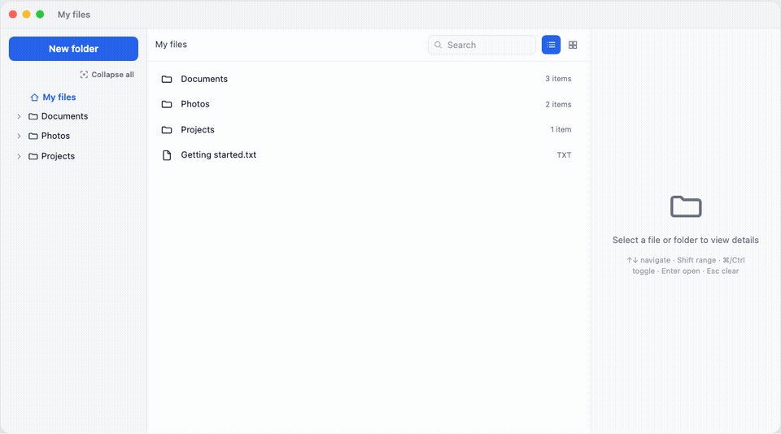

# @halazv2/react-file-manager

[](https://www.npmjs.com/package/@halazv2/react-file-manager)
[](./LICENSE)
[](https://halazv2.github.io/react-file-manager/)

Headless-ish React file browser with **Finder-style spring-loaded folders**, drag-and-drop, built-in icons, pins/recents, in-pane preview, and host-driven action menus. Bring your own data and API — keep viewers (Foxit, OnlyOffice) and domain actions in the host.

**Live demo:** https://halazv2.github.io/react-file-manager/



Hover a folder while dragging — it expands in the sidebar and opens in the browser after a short delay, just like macOS Finder.

## Install

```bash
npm install @halazv2/react-file-manager
```

Peer dependencies: `react` and `react-dom` ≥ 18. Optional peer: `pdfjs-dist` ≥ 4 (PDF first-page thumbnails).

### Styling (three layers)

Anything else (utility classes, extra BEM modifiers) is internal.

1. **CSS variables** on `.rfm-root` — theming  
2. **`aria-*` / `data-*`** — state (`aria-selected`, `aria-pressed`, `aria-expanded`, `aria-busy`, `data-theme`, `data-focused`, `data-drop-target`, `data-view`, `data-kind`)  
3. **`classNames` slots + root `className` / `style`** — escape hatch  

Import the published stylesheet **before** Tailwind v4, or declare `@layer rfm, theme, base, components, utilities;` first. A `@layer rfm` sheet imported *after* Tailwind ranks above `@layer utilities` and would beat `className="p-8"`.

```ts
import "@halazv2/react-file-manager/styles.css";
```

```css
@layer rfm, theme, base, components, utilities;
@import "@halazv2/react-file-manager/styles.css";
@import "tailwindcss";

.rfm-root {
  --rfm-accent: #0f766e;
  --rfm-selected: color-mix(in srgb, var(--rfm-accent) 12%, transparent);
}

.rfm-item[aria-selected="true"] {
  box-shadow: inset 0 0 0 1px var(--rfm-accent);
}
```

Tokens (defaults on `:where(.rfm-root)`): `--rfm-accent`, `--rfm-accent-fg`, `--rfm-surface`, `--rfm-surface-sunken`, `--rfm-surface-hover`, `--rfm-selected`, `--rfm-text`, `--rfm-text-muted`, `--rfm-border`, `--rfm-danger`, `--rfm-radius`, `--rfm-radius-sm`, `--rfm-font`, `--rfm-font-size`, `--rfm-font-size-sm`, `--rfm-sidebar-width`, `--rfm-details-width`, `--rfm-row-height`, `--rfm-duration`, `--rfm-icon-accent`, `--rfm-icon-outline`, `--rfm-star`, `--rfm-shadow`.

Pass `theme="dark"` or `theme="light"` to set `data-theme` on the root (omit for `prefers-color-scheme`).

## Quick start

```tsx
import { FileManager, moveNodes, type FileManagerNode } from "@halazv2/react-file-manager";
import { useState } from "react";

const initial: FileManagerNode[] = [
  {
    id: "docs",
    name: "Documents",
    kind: "folder",
    children: [{ id: "notes", name: "notes.txt", kind: "file", extension: "txt" }]
  }
];

export function App() {
  const [nodes, setNodes] = useState(initial);

  return (
    <div style={{ height: 560 }}>
      <FileManager
        nodes={nodes}
        storageKey="my-app-files"
        onMove={(ids, folderId) =>
          setNodes((current) => moveNodes(current, ids, folderId))
        }
        onOpenFile={(id) => console.log("open", id)}
        onGetPreviewUrl={(id) => `/api/files/${id}/preview`}
        onUpload={(files, folderId) => console.log(files, folderId)}
        onImport={(items, folderId) => console.log(items, folderId)}
        onCreateFolder={(parentId) => console.log("new folder in", parentId)}
        onCreateFile={(folderId) => console.log("new file in", folderId)}
        onRename={(id, name) => console.log("rename", id, name)}
        onDownloadFile={(id) => console.log("download", id)}
        getItemActions={(node) => [
          { id: "open", label: "Open", onClick: () => console.log(node.id) }
        ]}
        getBulkActions={(ids) => [
          { id: "merge", label: "Merge", onClick: () => console.log(ids) }
        ]}
      />
    </div>
  );
}
```

The component fills its parent. Give the parent a height.

## What it includes

- Three-pane layout: sidebar, browser (list/cards), details
- Built-in extension-aware file/folder icons with readable, color-coded extension badges
- Pins and recent folders (`storageKey` → localStorage)
- Breadcrumbs, multi-select, keyboard navigation
- Drag-and-drop move with spring-loaded folders
- OS file drops via `onUpload`; OS folder drops via `onImport` (keeps the folder tree)
- Virtualized list view for large folders
- In-pane preview: images always; PDF first page + text when `pdfjs-dist` is installed and `onGetPreviewUrl` is set
- Context / “more” menus via `getItemActions`
- Bulk action bar via `getBulkActions` (Open / Delete defaults when callbacks exist)
- Rename, download file/folder, create file hooks
- Theme tokens (`--rfm-accent`, `--rfm-selected`, surfaces)

Host apps own document viewers, merge/split, RBAC, and domain modals — wire them through callbacks and action getters.

## Adapter example (reflow-style)

```ts
import type { FileManagerNode } from "@halazv2/react-file-manager";

type LibraryNode = {
  id: number;
  name: string;
  type: "folder" | "file";
  children?: LibraryNode[];
  extension?: string;
  file?: string;
};

export function mapLibraryToNodes(nodes: LibraryNode[]): FileManagerNode[] {
  return nodes.map((node) => ({
    id: String(node.id),
    name: node.name,
    kind: node.type === "folder" ? "folder" : "file",
    extension: node.extension,
    children: node.children ? mapLibraryToNodes(node.children) : undefined,
    meta: { file: node.file, sourceId: node.id }
  }));
}
```

## Props

Every `FileManagerProps` field:

| Prop | Type | Notes |
| --- | --- | --- |
| `nodes` | `FileManagerNode[]` | Nested tree. Root is implied. |
| `folderId` | `string \| null` | Controlled current folder. `null` is root. |
| `defaultFolderId` | `string \| null` | Uncontrolled initial folder. |
| `onFolderChange` | `(id: string \| null) => void` | Fired when the current folder changes. |
| `selectedIds` | `string[]` | Controlled selection. |
| `defaultSelectedIds` | `string[]` | Uncontrolled initial selection. |
| `onSelectionChange` | `(ids: string[]) => void` | Fired when selection changes. |
| `view` | `"list" \| "cards"` | Controlled browser view. |
| `defaultView` | `"list" \| "cards"` | Uncontrolled initial view. Default `list`. |
| `onViewChange` | `(view) => void` | Fired when the view toggle changes. |
| `searchQuery` | `string` | Controlled search string. |
| `defaultSearchQuery` | `string` | Uncontrolled initial search. |
| `onSearchChange` | `(query: string) => void` | Fired as the search field changes. |
| `onOpenFolder` | `(id: string \| null) => void` | Fired when a folder is opened (sidebar, double-click, Enter). |
| `rootLabel` | `string` | Label for the implied root. Default `"My files"`. |
| `className` | `string` | Extra class on `.rfm-root`. |
| `style` | `CSSProperties` | Inline style on `.rfm-root`. |
| `theme` | `"light" \| "dark"` | Sets `data-theme` on the root. Omit for `prefers-color-scheme`. |
| `classNames` | `FileManagerClassNames` | Slot classes: `root`, `layout`, `sidebar`, `browser`, `details`, `item`, `treeRow`, `toolbar`, `search`, `menu`, `more`, `bulkBar`, `iconButton`, `viewToggle`. |
| `isBusy` | `boolean` | Shows the in-pane busy overlay (`aria-busy`). |
| `storageKey` | `string` | Pins / recents localStorage key prefix. |
| `onMove` | `(ids, folderId) => void` | Fired on drop. Use `moveNodes` for local state. |
| `onOpenFile` | `(id) => void` | Double-click or Enter on a file. |
| `onGetPreviewUrl` | `(id) => string \| null \| Promise<…>` | Preview URL for details pane. |
| `onUpload` | `(files, folderId) => void` | File picker or OS file drop. Folder drops without `onImport` are flattened into files with `webkitRelativePath`. |
| `onImport` | `(items, folderId) => void` | OS folder (and mixed) drops as a tree. Prefer this to create folders instead of documents. |
| `onCreateFolder` | `(parentId) => void` | New folder action. |
| `onCreateFile` | `(folderId) => void` | Optional “new document” entry. |
| `onRename` | `(id, name) => void` | Inline rename (F2 or menu). Sets `data-editing` on the row. |
| `labels` | `Partial<FileManagerLabels>` | Override UI copy (search, empty states, menus, live announcements). |
| `components` | `{ Row?, Sidebar?, Browser?, DetailsPane? }` | Replace layout pieces. Default remains batteries-included. |
| `onDownloadFile` / `onDownloadFolder` | `(id) => void` | Download hooks. |
| `onDelete` | `(ids) => void` | Delete / Backspace. |
| `getItemActions` | `(node) => FileManagerAction[]` | Context / more menu items. |
| `getBulkActions` | `(ids) => FileManagerAction[]` | Multi-select bar actions. |
| `canManage` | `boolean` | Disables drag, drop, and mutations. Default `true`. |
| `enablePreview` | `boolean` | Default `true` when `onGetPreviewUrl` is set. |
| `springLoadDelay` | `number` | Hover delay in ms. Default `500`. |
| `showDetails` | `boolean` | Inspector pane. Default `true`. Collapses below ~900px via container queries. |
| `renderIcon` | `(node, size?) => ReactNode` | Override built-in icons. |
| `renderPreview` | `(node) => ReactNode` | Replace the details pane. |
| `renderActions` | `(node) => ReactNode` | Extra per-item actions. |

`FileManagerNode`:

```ts
type FileManagerNode = {
  id: string;
  name: string;
  kind: "folder" | "file";
  children?: FileManagerNode[];
  extension?: string;
  size?: number;
  meta?: Record<string, unknown>;
};
```

## Icons

`FileTypeIcon`, `FolderTypeIcon`, and `defaultNodeIcon` are public exports for host layouts. The built-in set recognizes 20+ extensions and shows each one as a readable, color-coded document badge; unknown extensions fall back to a labeled document glyph. Use `renderIcon` to replace these defaults for any node.

`FileManagerDropItem` (OS drops into `onImport`):

```ts
type FileManagerDropItem =
  | { kind: "file"; name: string; file: File }
  | { kind: "folder"; name: string; children: FileManagerDropItem[] };
```

`FileManagerAction`:

```ts
type FileManagerAction = {
  id: string;
  label: string;
  onClick: () => void | Promise<void>;
  disabled?: boolean;
  danger?: boolean;
  icon?: ReactNode;
};
```

## Compound API

`<FileManager />` stays batteries-included. For a custom shell, call `useFileManager(props)` (the same controller) and/or pass `components`:

```tsx
import {
  FileManager,
  FileManagerBrowser,
  FileManagerDetailsPane,
  FileManagerRow,
  FileManagerSidebar,
  useFileManager,
} from "@halazv2/react-file-manager";

<FileManager
  nodes={nodes}
  components={{
    Row: FileManagerRow,
    Sidebar: FileManagerSidebar,
    Browser: FileManagerBrowser,
    DetailsPane: FileManagerDetailsPane,
  }}
/>
```

`useFileManager` must run under your own providers if you render the slot components yourself; the default `<FileManager />` already provides context.

Tree helpers (`listFolder`, `moveNodes`, `searchNodes`, …) stay exported for host state.

## Next.js / SSR

The package entry is a Client Component (`"use client"`). In the App Router, import `FileManager` from a client module.

`storageKey` pin/recent helpers no-op when `window` is undefined (SSR). They read `localStorage` only in the browser.

## Known limitations

- **Touch drag-and-drop** is not implemented yet. Internal moves use HTML5 `draggable` (mouse / trackpad). Touch support is planned.
- Card view is not virtualized (list view is, after 40 items).
- Host callback rejections (`onMove`, `onRename`, …) are not surfaced yet.

## Roadmap

Shipped in **0.3.0**: icons, theming tokens, pins/recents, preview pipeline, action menus, bulk bar, rename/download/create-file hooks.

Still optional follow-ups:

- **Upload widgets** — richer dropzones and progress UI
- **Theming presets** — ready-made light/brand skins beyond CSS variables
- **Mobile redesign** — touch-first layout and gestures
- **iAfford adapter** — swap hard-coded LibraryFileManager for this package (after reflow validation)

## Local demo

```bash
npm install
npm run dev
```

## License

MIT
